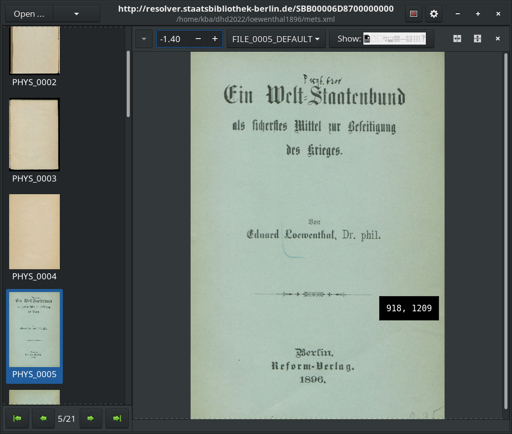
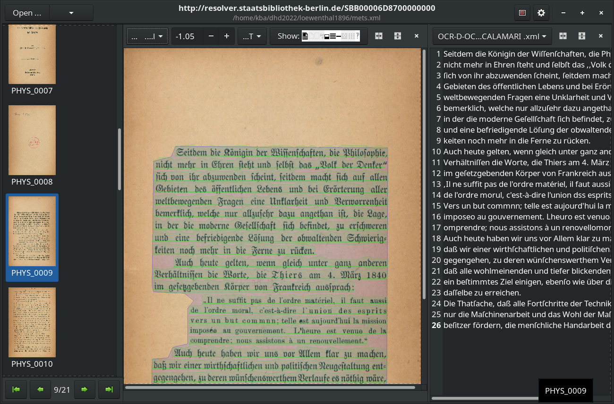
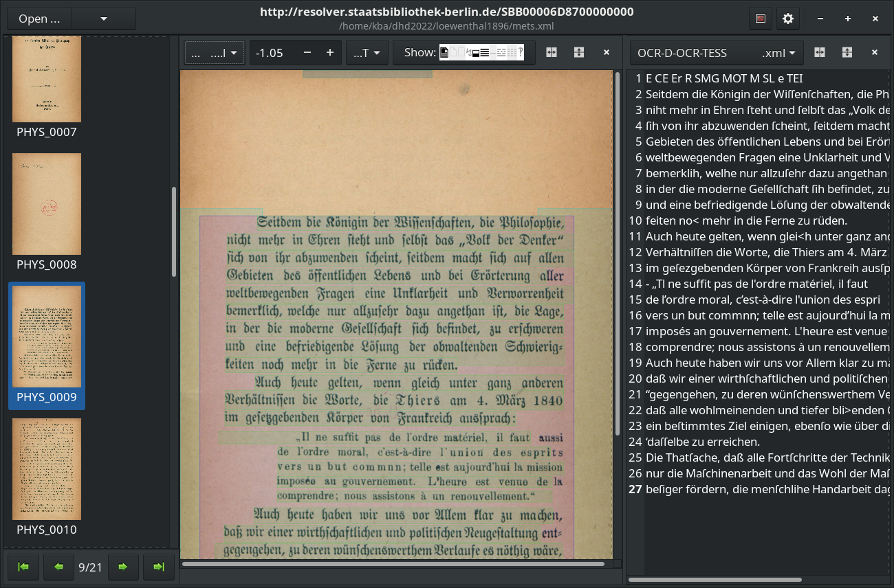
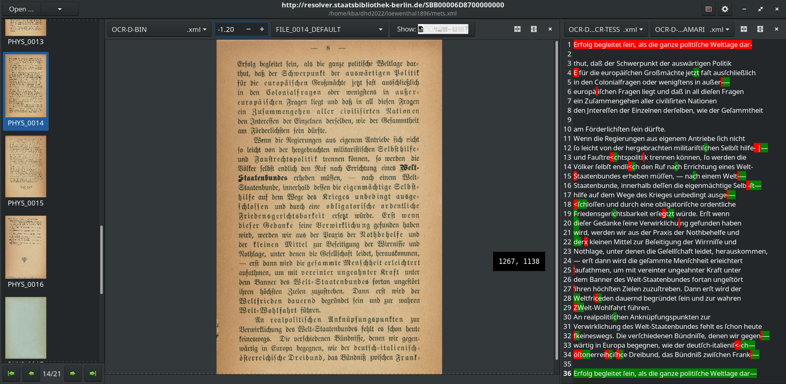

# Demo OCR-D @ DHd 2022

## Demo 1 - Download einer METS und inspizieren des OCR-D Workspace

* Werk: https://digital.staatsbibliothek-berlin.de/werkansicht?PPN=PPN680203753
* METS: https://content.staatsbibliothek-berlin.de/dc/PPN680203753.mets.xml

Wir laden ("klonen") das METS-XML für das Werk

```sh
ocrd workspace clone -d loewenthal1896 https://content.staatsbibliothek-berlin.de/dc/PPN680203753.mets.xml
```

Wechseln wir in das Verzeichnis und listen alle im METS verzeichneten Dateien:

```sh
cd loewenthal1896
ocrd workspace find -k fileGrp -k mimetype -k ID -k url

FULLTEXT	text/xml	https://content.staatsbibliothek-berlin.de/dc/PPN680203753-00000001.ocr.xml	FILE_0001_FULLTEXT
FULLTEXT	text/xml	https://content.staatsbibliothek-berlin.de/dc/PPN680203753-00000002.ocr.xml	FILE_0002_FULLTEXT
FULLTEXT	text/xml	https://content.staatsbibliothek-berlin.de/dc/PPN680203753-00000003.ocr.xml	FILE_0003_FULLTEXT
[...]
```

Die `PRESENTATION` Dateigruppe enthält Referenzen, mit denen `browse-ocrd` nicht zurecht kommt, daher entfernen wir diese Referenzen:

```sh
ocrd workspace remove-group -kr PRESENTATION
```

Die hochauflösendsten Bilder, die in der METS referenziert sind, sind in der
`DEFAULT` Dateigruppe.

```sh
ocrd -l DEBUG workspace find --file-grp DEFAULT --download
```

(Mit der `-l/--log-level DEBUG`-Option schalten wir detailliertes Logging ein, um den Fortschritt des Downloads beobachten zu können)

Dann können wir uns diesen Workspace mit browse-ocrd ansehen

```sh
browse-ocrd mets.xml
```



## Demo 2: Minimalworkflow mit tesseract

Der OCR-D Prozessor für tesseract kann optional einen kompletten OCR-Workflow durchführen, vergleichbar mit dem Aufruf des `tesseract` Kommandozeilentools.

```sh
ocrd-tesserocr-recognize -I DEFAULT -O OCR-D-OCR-TESS -P find_tables false -P textequiv_level word -P segmentation_level region -P model Fraktur
```

## Demo 3 - Binarisierung, Segmentierung, Erkennung mit Calamari

Für die Binarisierung verwenden wir den `ocrd-cis-ocropy-binarize` Prozessor:

```sh
ocrd-cis-ocropy-binarize -I DEFAULT -O OCR-D-BIN
```

Anschließend nutzen wir kraken für die Segmentierung. Dafür benötigen wir das vortrainierte Baseline-Segmentierungsmodell, das wir mit `ocrd resmgr`, dem OCR-D-Resourcenmanager, herunterladen können:

```sh
ocrd resmgr download ocrd-kraken-segment blla.mlmodel
```

Und den eigentlichen Prozessoraufruf:

```sh
ocrd-kraken-segment -I OCR-D-BIN -O OCR-D-SEG-KRAKEN
```

Schließlich führen wir den OCR-D Calamari Prozessor aus für die Texterkennung, mit dem `qurator-gt4histocr-1.0` Modell, das wir auch über den Resource Manager installieren:

```sh
ocrd resmgr download ocrd-calamari-recognize qurator-gt4histocr-1.0
```

```sh
ocrd-calamari-recognize -I OCR-D-SEG-KRAKEN -O OCR-D-OCR-CALAMARI -P checkpoint_dir qurator-gt4histocr-1.0
```

## Demo 4 - In browse-ocrd betrachten





## Tools

* [OCR-D/core](https://github.com/OCR-D/core)
* [OCR-D/ocrd\_calamari](https://github.com/OCR-D/ocrd_calamari)
* [OCR-D/ocrd\_tesserocr](https://github.com/OCR-D/ocrd_tesserocr)
* [kba/ocrmultieval](https://github.com/kba/ocrmultieval)
* [cisocrgroup/ocrd\_cis](https://github.com/OCR-D/ocrd_cis)
* [browse-ocrd](https://github.com/hnesk/browse-ocrd)

